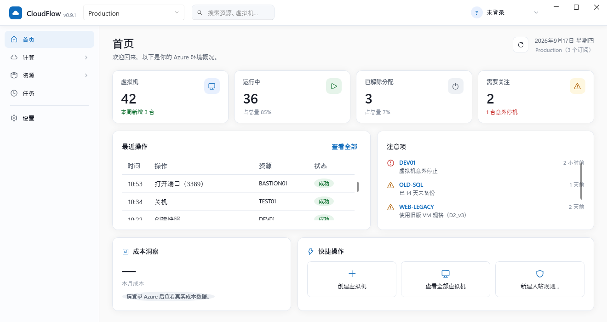

# CloudFlow

> CloudFlow for Microsoft Azure — 面向 Microsoft Azure 的多账号、多租户、多订阅、模块化云资源智能运维平台。



## 当前状态

当前版本：**v0.8.0**。首个交付模块：**Compute / Virtual Machine Operations Center**；另含资源组 / 所有资源的清理入口、系统托盘图标（开机启动 / 关闭到通知区域）、NSG 规则 Allow/Deny 创建。

- 变更记录：根目录 `CHANGELOG.md`；每个版本的完整记录见 `releases/vX.Y.Z/CHANGELOG.md`
- 许可证：[GPL-3.0](LICENSE)；随源码分发的第三方组件见 [`THIRD-PARTY-NOTICES.md`](THIRD-PARTY-NOTICES.md)

## 功能

- **多账号 / 多租户 / 多订阅**：工作或学校账户（MSAL 设备码流程）与个人 Microsoft 账户
  （嵌入式 Azure CLI 设备码流程，首次使用自动下载 Runtime）可同时登录多个，顶栏随时切换；
  顶栏 **Scope 选择器**可以圈定单个订阅，也可以是"所有订阅"的汇总视图。
- **虚拟机全生命周期运维**：两步向导创建（镜像 / 规格自动按 vCPU、内存、Hyper-V 世代匹配
  推荐；资源组、虚拟网络、子网"不存在则新建、存在则复用"）；启动、重启、关机、解除分配、
  改规格、删除（可选是否一并清理网卡/磁盘/公网 IP）等日常操作；详情页汇总网络、磁盘、
  性能、活动记录。
- **资源清理**：「所有资源」「资源组」两个入口，用于清理创建虚拟机流程按需新建、但删除
  虚拟机时刻意不会连带删除的网络类残留（虚拟网络/子网可能被同一资源组下其它资源共用）。
  两个列表都支持名称搜索框 + 按列的下拉筛选器（所有资源：类型/资源组/区域；资源组：
  区域/订阅），支持勾选批量删除，且都会先合并展示一次影响分析。删除资源组这类破坏性更大
  的操作要求输入资源名称本身才能确认。
- **统一的 Operation Engine**：所有写操作（创建、删除、电源变更……）都经过
  Validate → Impact → Permission → Execute → Verify → Audit 六个阶段，禁止任何按钮直连
  Azure SDK；失败时展示 Azure 返回的具体原因，而不是原始 HTTP 诊断信息。
- **任务中心**：记录所有写操作的执行历史（谁、什么时候、对哪个资源、做了什么、结果如何），
  顶栏"任务进行中"徽标随时显示后台任务进度。
- **应用内 SSH 终端**：虚拟机详情页/列表页直接发起连接，底部面板支持多标签会话；连接凭据
  用本机 DPAPI 加密保存；主机指纹两段式校验（首次记录需确认、变化时强提示，不静默接受）。
- **成本洞察**：已登录真实账户时，首页展示当前 Scope 的实际 Azure 账单数据。

功能详细用法见 [`docs/user-guide.md`](docs/user-guide.md)。

## 文档

| 文档 | 内容 |
| --- | --- |
| [`docs/user-guide.md`](docs/user-guide.md) | 用户手册：界面各部分怎么用 |
| [`docs/authentication.md`](docs/authentication.md) | 认证说明：如何配置账户登录 |
| [`docs/architecture.md`](docs/architecture.md) | 公开架构：核心设计原则与模块划分 |
| [`docs/development.md`](docs/development.md) | 开发指南：环境搭建、构建、测试 |
| [`docs/provider-development.md`](docs/provider-development.md) | 如何新增一种资源/操作 |
| [`CONTRIBUTING.md`](CONTRIBUTING.md) | 贡献指南 |

## 技术栈

| 层 | 技术 |
| --- | --- |
| UI | WPF + WPF-UI (Fluent Design) + CommunityToolkit.Mvvm，.NET 8 |
| 架构 | Platform Services + Resource Modules（Account → Tenant → Scope → Resource → Operation） |
| 身份认证 | MSAL.NET（工作/学校账户）+ 嵌入式 Azure CLI（个人账户，设备码流程，按需下载） |
| 资源发现 | Azure Resource Graph（已接入；**未登录时**回退 Mock 演示数据，已登录时真实查询失败会如实报错、不回退） |
| 终端 | WebView2 + xterm.js（应用级底部面板，多标签会话） |
| 写操作 | 统一 Operation Engine（Validate → Impact → Permission → Execute → Verify → Audit） |

详见 [`docs/architecture.md`](docs/architecture.md)。

## 快速开始

```bash
# 构建
dotnet build CloudFlow.sln

# 测试
dotnet test CloudFlow.sln

# 运行桌面应用（未配置账户时为 Demo 模式，使用模拟数据）
dotnet run --project src/CloudFlow.App
```

完整开发环境说明见 [`docs/development.md`](docs/development.md)。

## 账户配置

CloudFlow 用 Entra ID App Registration（Public Client，无 Secret）登录工作或学校账户，个人
Microsoft 账户走嵌入式 Azure CLI 设备码登录。完整配置步骤、登录说明与故障排查见
[`docs/authentication.md`](docs/authentication.md)。

## 目录结构

```
src/
  CloudFlow.Core          # 平台核心模型：Identity / Scopes / Resources / Operations / Errors
  CloudFlow.Data          # 本地持久化（Saved Scopes、Audit 等）
  CloudFlow.Operations    # Operation Engine（操作总线）
  CloudFlow.Azure         # Azure 适配层：MSAL 认证、ARM、Resource Graph
  CloudFlow.Terminal      # SSH 会话与凭据库（DPAPI 保险库、主机指纹校验、终端控件）
  Modules/
    CloudFlow.Modules.Compute   # 计算模块（Virtual Machines）
    CloudFlow.Modules.Network   # 网络与通用资源模块（NSG / 资源组 / 通用资源删除）
  CloudFlow.App           # WPF 桌面应用
tests/                    # 按项目拆分的单元测试与 Azure 集成测试
tools/CloudFlow.Spike     # 独立技术验证控制台（不随发布产物分发）
docs/                     # 用户与贡献者文档
```

详见 [`docs/architecture.md`](docs/architecture.md#模块与代码组织)。
